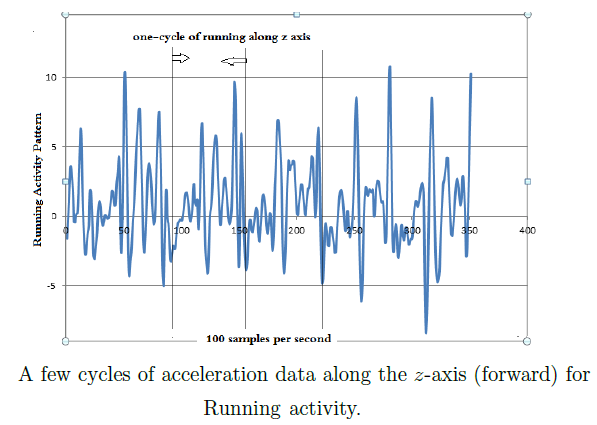
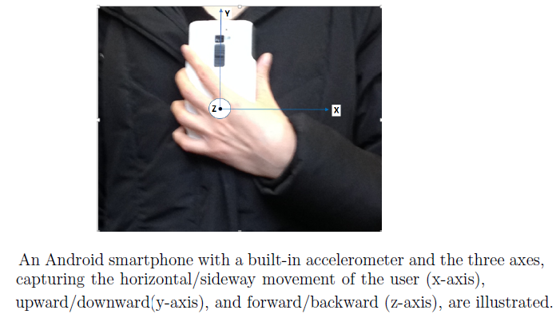

# Human-Activity-Recognition
The goal of this project is to answer the following question: How could we construct the models based on accelerometer data that can recognize human daily activities and can identify users based on their gait characteristics? We analyze accelerometer data collected in the experiments from human subjects while performing physical activities in real-world conditions. Our objective is to extract a unique domain-free representation of this acceleration data that could lead to a robust and precise classification regardless of the recognition task. 
 

